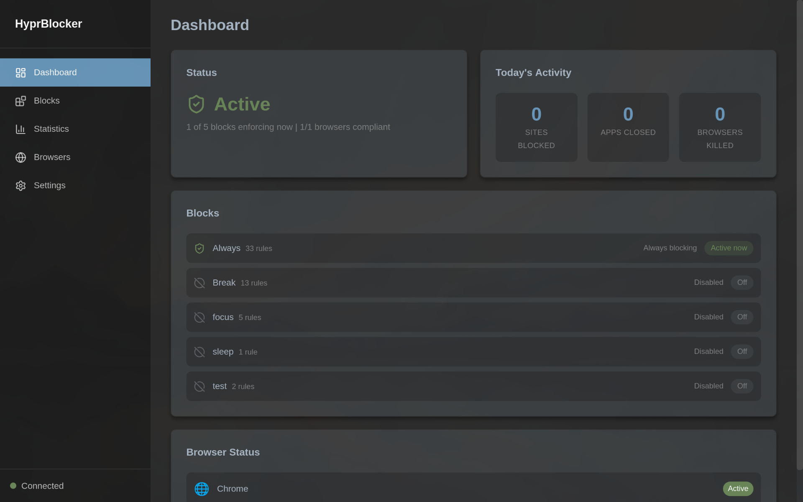
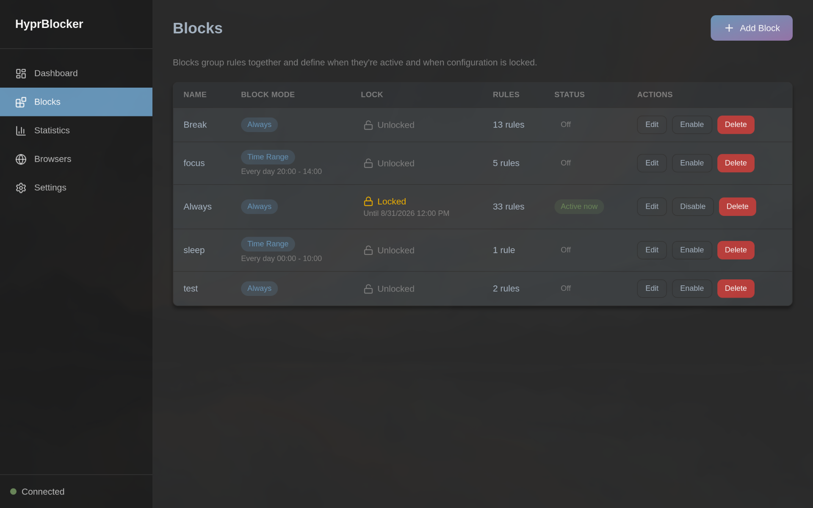
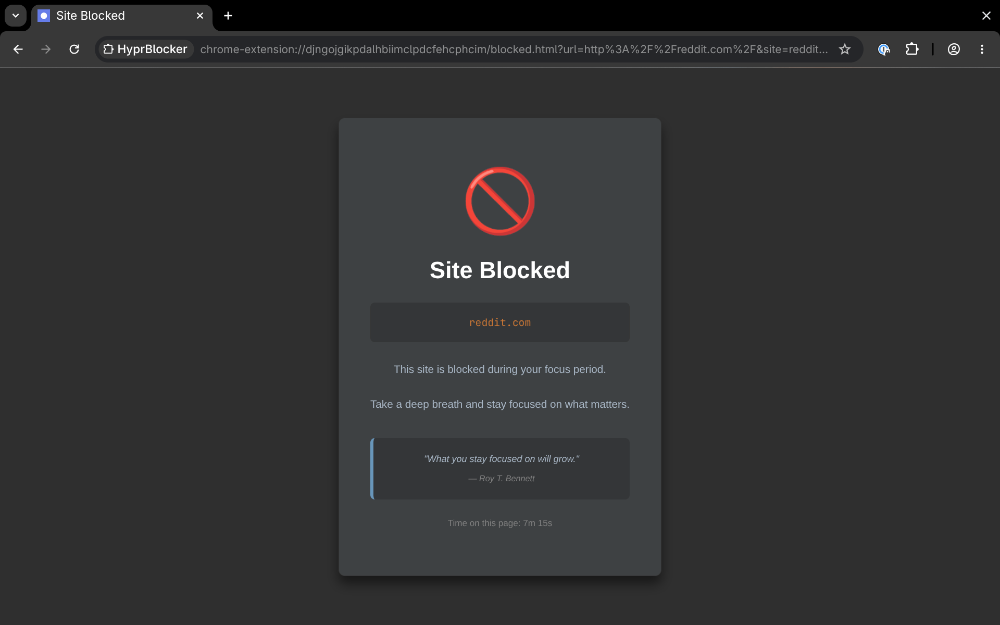

# HyprBlocker

[](https://github.com/TTeuber/HyprBlocker/actions/workflows/ci.yml)
<!-- [](https://codecov.io/gh/TTeuber/HyprBlocker) -->
[](LICENSE)


A self-control website and application blocker for Linux + Hyprland, built around a **tamper-resistant daemon**. Blocks distracting sites and apps on a schedule, and is deliberately hard to switch off in a moment of weakness — watchdog processes, NTP-verified time locks, and browser enforcement all work to keep the block in place until it's supposed to end.

---

---

## Why this project is interesting

Most website blockers are trivially bypassed: kill the process, change the clock, or uninstall the extension. HyprBlocker treats "future me trying to cheat" as the adversary and defends in depth:

| Bypass attempt | Defense |
| --- | --- |
| Kill the daemon | Systemd auto-restart, plus 2–5 independent [watchdog processes](docs/WATCHDOG.md) with obfuscated names that monitor the daemon *and each other* |
| Stop the systemd service | Daemon refuses `SIGTERM` while shutdown prevention is on |
| Change the system clock to end a lock early | Lock expiry is verified against **NTP time**, not the local clock |
| Disable or remove the browser extension | Daemon tracks extension heartbeats and **closes any browser** that stops reporting (60s timeout) |
| Use incognito mode | Extension reports incognito status; enforcement requires it to be enabled |
| Spoof the extension's identity | Native messaging host verifies the real browser PID against Hyprland's window list |
| Edit settings during a block | Locks are tightening-only: stricter rules and protections can still be *added*, but nothing can be loosened until the lock expires |
| Edit the unit, code, or database on disk | Optional [root-owned mode](#root-owned-architecture-optional-opt-in) moves code and enforcement state behind sudo; a root enforcer service repairs tampering and delays any loosening change by 24–48h |

The design principle throughout: **the daemon is the source of truth and the extension is untrusted**. In-browser blocking is a convenience layer; the real enforcement is the daemon killing non-compliant browsers via Hyprland IPC. And when anything fails — network, database, NTP — the system **fails closed** (blocks) rather than open.

It's equally honest about what it *can't* stop — see [Limitations](#limitations).

---

---

## Features

- **Website blocking** — domain, subdomain, wildcard (`*.reddit.com`), path-specific (`youtube.com/shorts`), and catch-all (`*` = every http(s) URL, with allow-list exceptions)
- **Media / resource-type blocking** — keep a site navigable but cancel images, video, and audio (and typical media fetches) on matching pages; `*` strips media everywhere except allows
- **Allow-list exceptions** — block all of Reddit except `reddit.com/r/programming`
- **App blocking** — closes blocked applications via Hyprland IPC (window-class matching)
- **Scheduling** — always-on or time ranges per weekday (e.g. weekdays 9–5)
- **Lock mode** — block configuration becomes read-only while active
- **Settings lock** — freeze settings until a chosen date/time, NTP-verified; tightening-only, so protections can still be enabled while locked
- **Temporary access grants** — ask an AI judge (LLM via OpenRouter) for a time-limited exception to a blocked site; decisions follow an editable policy, fail closed, and are audit-logged
- **Grant judge policy** — shipped strict/lenient/accountability presets or a free-form document; while locked, only switching to a stricter preset is accepted
- **Root-owned mode (opt-in)** — two-tier deployment that moves code and enforcement state behind sudo, with a root enforcer that repairs tampering and delays loosening changes
- **Watchdog system** — self-healing mesh of processes that restart the daemon if killed
- **Safe search enforcement** — forces strict safe search on Google, Bing, and DuckDuckGo
- **Statistics** — track blocked attempts over time
- **Desktop GUI** — React + TypeScript frontend in a native pywebview window
- **System tray** — status icon and quick-access menu

---

---

## Architecture

```
┌─────────────────┐         ┌──────────────────────┐         ┌─────────────────┐
│  Desktop App    │  HTTP   │   Daemon (systemd)   │ Hyprland│   Applications  │
│  (pywebview +   │◄───────►│   - FastAPI server   │  IPC    │   & Browsers    │
│   React GUI)    │         │   - Block scheduler  │────────►│                 │
│                 │         │   - Lock enforcer    │         │                 │
│  - Config UI    │         │   - NTP verifier     │         │                 │
│  - View stats   │         │   - Watchdog manager │         │                 │
└─────────────────┘         └──────────┬───────────┘         └────────▲────────┘
                                       │                              │
┌─────────────────┐         ┌──────────▼────────────┐                 │
│   Tray App      │         │  Browser Extension    │  Heartbeat      │
│   (pystray)     │         │  - Blocks websites    │─────────────────┘
│                 │         │  - Sends heartbeat    │  (every 30s;
│  - Quick access │         │  - Safe search        │   silence = browser
│  - Status icon  │         └───────────────────────┘   gets closed)
└─────────────────┘
```

1. **Daemon** (`daemon/`) — Python/FastAPI systemd service; owns the database, schedules, and all enforcement
2. **Desktop app** (`desktop-app/`) — pywebview shell around a React + TypeScript (Vite) frontend
3. **Tray app** (`tray/`) — pystray/AppIndicator status icon
4. **Browser extension** (`extension/`) — Manifest v3 WebExtension; in-browser blocking + compliance heartbeat
5. **Root enforcer** (`enforcer/`) — optional root-tier system service (see [root-owned mode](#root-owned-architecture-optional-opt-in)); owns the authoritative lock and enforcement state, watches the user daemon, and fails closed

Deeper dives: [Watchdog system](docs/WATCHDOG.md) · [Systemd ordering & native messaging](docs/TECHNICAL_CONCEPTS.md) · [Root-owned architecture](documentation/ROOT_MIGRATION_DESIGN.md)

## Quick Start

Requires Arch Linux (or similar) with Hyprland, [uv](https://docs.astral.sh/uv/), and a Chromium- or Firefox-based browser.

### 1. Install dependencies

```bash
# System dependencies
sudo pacman -S webkit2gtk python-gobject

# Python dependencies
cd /path/to/HyprBlocker
uv sync
```

### 2. Run the install script

```bash
./install.sh
```

This builds the desktop and tray app executables into `~/.local/bin/`, copies the daemon and extension into place, creates the systemd service, and sets up tray autostart.

### 3. Start the daemon

```bash
systemctl --user enable --now hyprblocker

# Check status / logs
systemctl --user status hyprblocker
journalctl --user -u hyprblocker -f
```

### 4. Install the browser extension

**Chrome/Chromium:**

1. Go to `chrome://extensions/`, enable "Developer mode"
2. "Load unpacked" → select `~/.local/share/hyprblocker/extension/`
3. In the extension's details, enable **"Allow in incognito"** (required — enforcement checks for it)

### 5. Launch the desktop app

```bash
hyprblocker          # installed executable
# or from source:
uv run python desktop-app/main.py
```

## Usage

### Creating blocks

A *block* groups rules together and defines when they're enforced and when configuration is locked.

- **Block schedule**: always, time range (days + start/end time, overnight ranges supported), or disabled
- **Priority**: low, medium, or high (default low). Higher priority overrides lower for sites that block lists
- **Lock schedule**: none, or locked until a specific date/time
- **Rules** (one per line):

```
Blocked Websites          Media-blocked websites       Allowed Websites             Blocked Applications
*                         *                            openai.com                   steam
reddit.com                youtube.com                  radio.example.com            discord
youtube.com/shorts
twitter.com
```

**Catch-all `*`:** a literal `*` in **Blocked Websites** redirects **every** http(s) page to the blocked page. A literal `*` in **Media-blocked websites** strips images/video/audio on **every** page. Use **Allowed Websites** on the same block as the exception list (e.g. tools, radio). `http*` and similar globs are **not** catch-alls — only the single-character pattern `*`. Browser internals (`chrome://`, `chrome-extension://`, `about:`, `edge:`) and loopback (`localhost` / `127.0.0.1`, including the daemon on port 8765) are never matched by `*`. If `*` and specific hosts appear in the same list, `*` dominates that list.

**Full-page vs media:** `youtube.com` in **Blocked Websites** redirects the tab to the blocked page. The same host only in **Media-blocked websites** leaves YouTube navigable but the extension cancels `image` / `media` / `object` requests initiated by that page, plus typical video/audio fetches (`xmlhttprequest`/`other` URLs such as `.mp4` or YouTube `videoplayback`). This is Chromium `declarativeNetRequest` inside the extension — not a proxy. After installing or updating the extension, reload it unpacked on `chrome://extensions`.

Media patterns use the same host/path syntax as blocked websites, plus `*`. Domain-only media rules match the **initiating document host** (including embeds of that host on other pages). Path-specific media rules (e.g. `youtube.com/shorts`) apply to the tab's document URL — Chromium cannot filter by initiator path. Catch-all media uses a global DNR block plus higher-priority allows for domain-wide exceptions and tab session rules for the rest.

Allow lists and grants still use intersection logic. A domain-wide allow/grant on a host suppresses host-wide media DNR for that block; a path-only allow does not re-enable media under a **domain-wide** media rule (fail-closed). Under catch-all `*`, a matching allow (domain or path) leaves that page's media intact. Grants are requested against full-page `websites_blocked` matches; an existing grant also overlays onto media-matching blocks (including `*`).

### Pattern matching

| Pattern | Matches |
| --- | --- |
| `*` | every http(s) URL (not chrome://, extension pages, about:, edge:, or localhost) |
| `reddit.com` | reddit.com, all subdomains, all paths |
| `youtube.com/shorts` | only that path and its subpaths |
| `*.reddit.com` | all subdomains |
| `old.reddit.com` | only that subdomain |
| `steam` (app) | window class containing "steam" (e.g. `steam_app_123456`) |

Each block has a **priority**: low, medium, or high. New and existing blocks default to **low**.

For one URL, a block *cares* only when its own list matches — **Blocked Websites** for a full-page redirect, **Media-blocked websites** for media. An allow entry alone does not. Only the highest priority among blocks that care decides. Inside that band, the URL is allowed only if **every** caring block's allow list permits it (the same fail-closed intersection as before). Blocks that do not list the URL stay out of the vote, so other sites remain on the lower block.

To let `github.com` media through a low-priority media `*`, add a medium or high block that lists `github.com` under **both** Media-blocked websites and Allowed websites. Listing it only under Allowed does not override the lower block. The same shape applies to full-page blocks. Missing or unknown priority counts as low, so nothing changes until you raise a block.

App blocks are unchanged: any matching app rule still closes the app. Grants still add their allow pattern onto every field-matching block, which includes the winning band; there is no separate grant-versus-priority rule. A priority-only edit is not held by the unblock delay (a locked block still cannot be edited). Those two interactions are left as follow-up.

### Lock mode

While a block's lock is active: the block can't be edited or deleted, the daemon refuses to stop, and only *stricter* rules can be added. The settings lock applies the same asymmetry to global settings — protections (watchdogs, safe search, browser enforcement) can still be *enabled* or increased while locked, but nothing can be disabled or loosened — with expiry checked against NTP so changing the system clock doesn't help.

### Access grants

Instead of unlocking everything, you can request a **temporary exception** for a specific URL: give a reason and a duration, and an LLM judge (OpenRouter) decides per your grant-judge policy. Approved grants overlay an allow pattern onto every matching block and expire automatically; every request and verdict lands in an append-only audit log. No API key or no network means grants fail closed (deny) — the blocker itself never depends on the judge.

The judge policy is editable in Settings: pick a shipped preset (strict / lenient / accountability) or write your own. Switching to a stricter preset applies immediately; anything else counts as loosening — rejected while settings are locked, and in root-owned mode applied only after the enforcer's 24–48h delay.

### Browser status & grace period

The "Browsers" page shows which running browsers have a live extension heartbeat. "Add Extension" starts a 30-second grace period that pauses enforcement so you can install the extension without the browser being closed.

## Configuration Files

| File | Purpose |
| --- | --- |
| `~/.config/hyprblocker/config.json` | Daemon settings |
| `~/.config/hyprblocker/blocker.db` | SQLite database (blocks, events, heartbeats) |
| `~/.config/hyprblocker/watchdog_state.json` | Watchdog process state |
| `~/.config/hyprblocker/daemon.log` | Daemon log |
| `~/.config/systemd/user/hyprblocker.service` | Systemd unit |
| `.env` (repo root) | `OPENROUTER_API_KEY` for the grant judge (optional — without it, grant requests are denied) |

In root-owned mode the code moves to `/opt/hyprblocker` and state to `/var/lib/hyprblocker` (user-writable `user/`, root-owned `secure/`) — see [`documentation/ROOT_INSTALL.md`](documentation/ROOT_INSTALL.md).

## API

The daemon exposes a REST API on `http://127.0.0.1:8765`. Highlights:

| Endpoint | Method | Purpose |
| --- | --- | --- |
| `/api/status` | GET | Daemon status, active blocks |
| `/api/blocks` | GET/POST | List/create blocks |
| `/api/blocks/{id}` | PUT/DELETE | Update/delete (refused while locked) |
| `/api/blocks/{id}/strict` | PATCH | Add stricter rules (allowed while locked) |
| `/api/heartbeat` | POST | Browser extension heartbeat |
| `/api/blocked-sites` | GET | Current patterns, consumed by the extension |
| `/api/settings/lock` | GET/POST/DELETE | NTP-verified settings lock |
| `/api/settings/watchdog` | GET/PUT | Watchdog enable/disable |
| `/api/settings/judge-policy` | GET/PUT | Grant-judge policy (presets + free-form; tightening-only while locked) |
| `/api/grants/request` | POST | Ask the AI judge for a temporary exception |
| `/api/grants` | GET | List active grants |

## Development

### Running from source

```bash
uv run python -m daemon.main        # daemon in foreground
uv run python desktop-app/main.py   # desktop app
uv run python tray/main.py          # tray app

cd desktop-app/frontend && bun dev  # frontend with hot reload
```

### Tests & linting

```bash
uv run pytest --cov=daemon   # unit + API tests with coverage
uv run ruff check .          # Python lint
bun test extension           # extension pattern-matching tests (daemon parity)
cd desktop-app/frontend && bun run lint && bun run build
```

CI runs all of the above on every push (see `.github/workflows/ci.yml`).

### Debugging

```bash
curl http://127.0.0.1:8765/api/status | python3 -m json.tool   # daemon alive?
curl http://127.0.0.1:8765/api/browsers                        # extension heartbeats
hyprctl clients -j | jq '.[] | {class, pid, title}'            # what Hyprland sees
journalctl --user -u hyprblocker -n 50 --no-pager          # recent daemon logs
```

## Limitations

**This is designed for self-control, not parental controls.** A determined user with system access can always win:

- Booting into recovery mode sidesteps everything
- Editing the database directly (when no lock is active)

The threat model is *impulsive* bypass, not adversarial admin access. The watchdog mesh, obfuscated process names, and NTP-verified locks are there to make cheating take long enough that the impulse passes. For genuinely adversarial scenarios you'd want network-level blocking or a separate restricted user account.

### Root-owned architecture (optional, opt-in)

An optional two-tier, root-owned deployment collapses the user-space bypasses above
(editable unit/code/state/manifests) into a single gate — typing the sudo password — by
moving the code, state, and enforcement into root-owned locations with a small root
enforcer service, and adds an AI-brokered scoped-grant system for least-privilege
exceptions. It is **not active until you deliberately install it** (`sudo ./install-root.sh`).
See [`documentation/ROOT_MIGRATION_DESIGN.md`](documentation/ROOT_MIGRATION_DESIGN.md) and
[`documentation/ROOT_INSTALL.md`](documentation/ROOT_INSTALL.md). sudo remains the
deliberate ceiling by design — that is the escape hatch and the residual bypass, and they
are the same action.

## License

[MIT](LICENSE)

---

Built for personal use on Arch Linux + Hyprland
